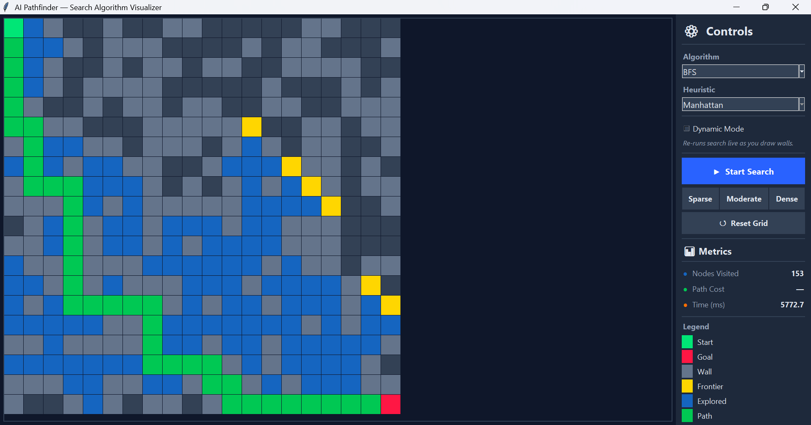
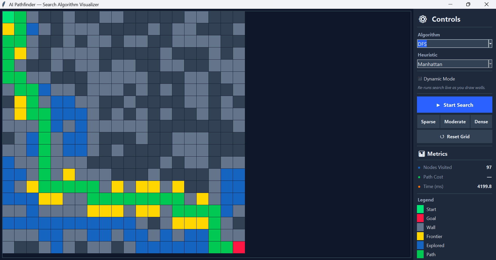
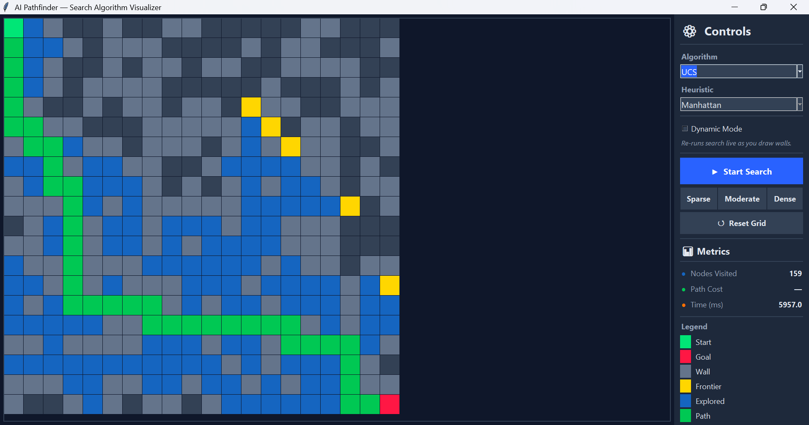
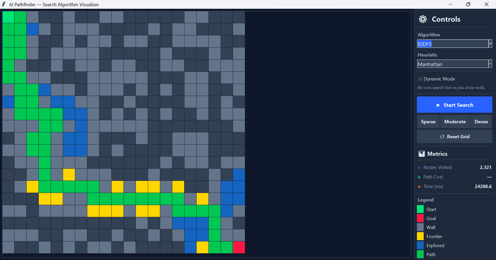

# 🧭 Pathfinding Visualizer — AI Search Algorithms


> **Watch how AI finds the shortest path, step by step!**

This is an interactive **Pathfinding Algorithm Visualizer** built with Python. It lets you draw walls on a grid, pick a search algorithm, and then watch it explore the map in real time to find the best route from the **start node** to the **goal node**.

Think of it like a maze solver — but you get to see every decision the AI makes along the way. The explored cells light up, the frontier expands, and when the algorithm is done, the shortest path glows on screen. It's a great way to understand how AI search actually works under the hood.

---

## 🤖 Algorithms Implemented

This project includes **7 search algorithms** — both informed (use heuristics) and uninformed (explore blindly).

### Informed Search Algorithms

These algorithms use a **heuristic** — a smart guess of how far the goal is — to decide which cell to explore next.

#### A\* (A-Star) Algorithm

A\* is one of the smartest pathfinding algorithms out there. It combines two things:

- **How far you've already walked** (the actual cost from the start)
- **How far you think you still need to go** (a heuristic estimate to the goal)

By adding both together, A\* always picks the most promising cell to explore next. That's why it finds the **shortest path** and does it efficiently. It's the gold standard for pathfinding.

#### Greedy Best-First Search (GBFS)

GBFS is simpler — it only cares about **how close a cell looks to the goal** (the heuristic). It doesn't track how far it has already traveled. This makes it faster in some cases, but it doesn't always find the shortest path. It's "greedy" because it rushes toward the goal without looking back.

Both A\* and GBFS support two heuristic functions:

| Heuristic | How It Works                                             |
| --------- | -------------------------------------------------------- |
| Manhattan | Counts horizontal + vertical distance (like city blocks) |
| Euclidean | Measures straight-line distance (as the crow flies)      |

### Uninformed Search Algorithms

These algorithms have **no idea** where the goal is. They explore the grid blindly, following their own rules until they stumble upon the goal.

#### Breadth-First Search (BFS)

BFS explores the grid **level by level** — it checks all cells 1 step away, then 2 steps away, then 3, and so on. Because it expands outward evenly in all directions, it **always finds the shortest path** (when all steps cost the same). It's simple, reliable, and easy to understand.

#### Depth-First Search (DFS)

DFS picks one direction and goes **as deep as possible** before backtracking. It's like walking into a maze and always turning left until you hit a dead end. It uses less memory than BFS, but the path it finds is usually **not the shortest** — it just finds _a_ path.

#### Uniform Cost Search (UCS)

UCS is like BFS, but smarter about costs. Instead of expanding level by level, it always expands the cell with the **lowest total cost so far**. This means it **always finds the cheapest path**, even when different steps have different costs. Think of it as A\* without the heuristic.

#### Iterative Deepening Depth-First Search (IDDFS)

IDDFS combines the best of BFS and DFS. It runs DFS with a depth limit of 1, then 2, then 3, and so on — going deeper each time. This way it uses **low memory like DFS** but **guarantees the shortest path like BFS**. It re-explores some cells, but that's a small price for the best of both worlds.

#### Bidirectional BFS

Bidirectional BFS runs **two BFS searches at the same time** — one from the start and one from the goal. When the two searches meet in the middle, the path is found. This can be **much faster** than regular BFS because each search only needs to explore half the distance.

---

## ✨ Features

- 🎨 **Interactive Grid** — Click to place walls, drag to draw them fast
- 🟢 **Start & Goal Nodes** — Clearly marked on the grid
- 🔍 **Live Visualization** — Watch the algorithm explore cells in real time
- 🛤️ **Path Highlighting** — See the final shortest path glow green
- 🗺️ **Map Generator** — Instantly create Sparse, Moderate, or Dense mazes
- 🔄 **Reset Grid** — Clear everything and start fresh
- 📊 **Metrics Panel** — Track visited nodes, path cost, and execution time
- ⚡ **Dynamic Mode** — Re-runs the search live as you draw walls
- 🎯 **Heuristic Selection** — Switch between Manhattan and Euclidean distance

---

## 📸 Screenshots

### A\* Algorithm — Manhattan Heuristic (Best Case)


### A\* Algorithm — Euclidean Heuristic (Best Case)


### GBFS — Manhattan Heuristic (Best Case)


### GBFS — Euclidean Heuristic (Best Case)


### A\* Algorithm — Manhattan Heuristic (Worst Case)


### GBFS — Manhattan Heuristic (Worst Case)


### BFS



### DFS



### UCS



### IDDFS



### Bidirectional BFS


---

## 🚀 How to Run the Project

Follow these simple steps:

**1. Clone the repository**

```bash
git clone https://github.com/Abdu1-Ahd/pathfinding-visualizer.git
```

**2. Go into the project folder**

```bash
cd pathfinding-visualizer
```

**3. Run the program**

```bash
python src/pathfinder.py
```

That's it! A window will open with the grid. Draw some walls, pick an algorithm, and hit **Start Search**.

> **Note:** This project only uses Python's built-in libraries (`tkinter`, `heapq`, `math`, etc.), so there's nothing extra to install. Just make sure you have **Python 3.7+** installed.

---

## 📦 Dependencies

| Library       | Included With Python? |
| ------------- | --------------------- |
| `tkinter`     | ✅ Yes                |
| `heapq`       | ✅ Yes                |
| `math`        | ✅ Yes                |
| `collections` | ✅ Yes                |
| `random`      | ✅ Yes                |
| `time`        | ✅ Yes                |

**No external packages needed.** Everything runs with a standard Python installation.

---

## 📁 Project Structure

```
pathfinding-visualizer/
│
├── src/
│   └── pathfinder.py        # Main application — all algorithms, GUI, and logic
│
├── screenshots/              # Images showing the algorithms in action
│   ├── Best case_Astar_Man.png
│   ├── Best case_Astar_Euc.png
│   ├── Best case_GBFS_Man.png
│   ├── Best case_GBFS_Euc.png
│   ├── Worst case_Astar_Man.png
│   ├── Worst case_GBFS_Man.png
│   └── ...
│
├── README.md                 # You're reading it right now!
├── requirements.txt          # Lists dependencies (all built-in)
└── .gitignore                # Keeps the repo clean
```

---

## 📚 Learning Purpose

This project was built as a university assignment to help students understand how **AI search algorithms** work in practice. Instead of just reading about them in a textbook, you can actually _see_ them in action — watching how they explore the grid, make decisions, and eventually find the path.

It's a hands-on way to learn:

- The difference between **informed** (A\*, GBFS) and **uninformed** (BFS, DFS, UCS, IDDFS, Bidirectional BFS) search
- How **heuristics** help algorithms make smarter choices
- Why **A\*** always finds the shortest path, while **DFS** often doesn't
- How **Manhattan** vs **Euclidean** distance affects algorithm behavior
- What the **frontier**, **explored set**, and **path** look like during a real search
- How **Bidirectional BFS** can find paths faster by searching from both ends

---

## 🙌 Credits

Built with ❤️ using **Python** and **Tkinter**.

---
